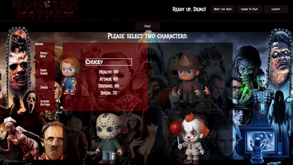
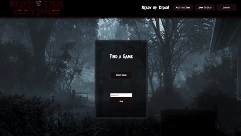

# Monster Mayhem
Monster Mayhem is an online multiplayer battle arena game based on classic horror movie characters.  The goal of the player is to use strategies based on characters' moves and abilities to diminish opposing characters health to zero.  The player to eliminate their opponents entire team wins. 

[Monster Mayhem Live](http://monstermayhem.herokuapp.com/)


## Technologies Used ##
+ Javascript
+ React.js/Redux.js
+ Express.js
+ MongoDB
+ Websockets 

## Features ##
Allow for users to create an account or login if user is already registered, but a demo login feature is implemented if user does not want to create an account for any reason

Players can select two characters to add to their team with each character having their own sets of movies and abilities. Adding characters calls an update to the user's team in the backend using react methods and its local state changes to send information through axios calls until two team slots are filled. Hovering over characters displays character stats, moves, and abilities. 



``` javascript
  addToTeam(e) {
    e.preventDefault();

    if (e.target.alt) {
      this.team.push(e.target.alt);
      console.log(e.target.alt)
    } else {
      this.team.push(e.target.title);
      console.log(e.target.title);
    }

    this.setState({
      userTeam: this.team,
    })

    if (this.team.length === 2) {
      alert('click fight to begin');
      console.log(this.team);
      this.props.updateUserTeam(this.props.user.id, { team: this.team, user:this.props.user.id });
    };
  };
 ```

```
 export default class Game extends React.Component {
  constructor(props) {
    super(props);
    this.state = {
      userTeam: [],
    }
    this.addToTeam = this.addToTeam.bind(this);
    this.team = [];
    this.currentUserId = this.props.user.id;
    console.log(this.currentUserId);

    this.removeFromTeam = this.removeFromTeam.bind(this);
  };
 ```
 

The game implements websockets to provide a temporary server, allowing for multiplayer experience through joining two players online through matching websocket identification numbers.  Players can battle each other in real time. 



``` javascript
const io = socketio(server);

io.on("connection", function (socket, data) {
  console.log("made connection with socket " + socket.id);

  socket.on("sendJoinRoomToBack", function (data) {
    Game.findById(data.gameId).then(game => {
      socket.join(game._id); //Join a room
      console.log("Joined room: " + game._id)
    })
  })

  socket.on("joinGame", function (id) {
    socket.join(id); //Join a room
    console.log("Joined game " + id)
    io.to(id).emit("receive-room", "made it")
      io.to(game._id).emit("startGame", {p1: game.p1, p2: game.p2})

  });

  socket.on("sendMoveToBack", function (data) {
    // console.log(data);
    io.to(data.gameId).emit("makeMove", data);
  });

  socket.on("sendMovesToBack", function(data) {
    console.dir(data);
    io.to(data.gameId).emit("handleTurn", data);
  })
});
```


